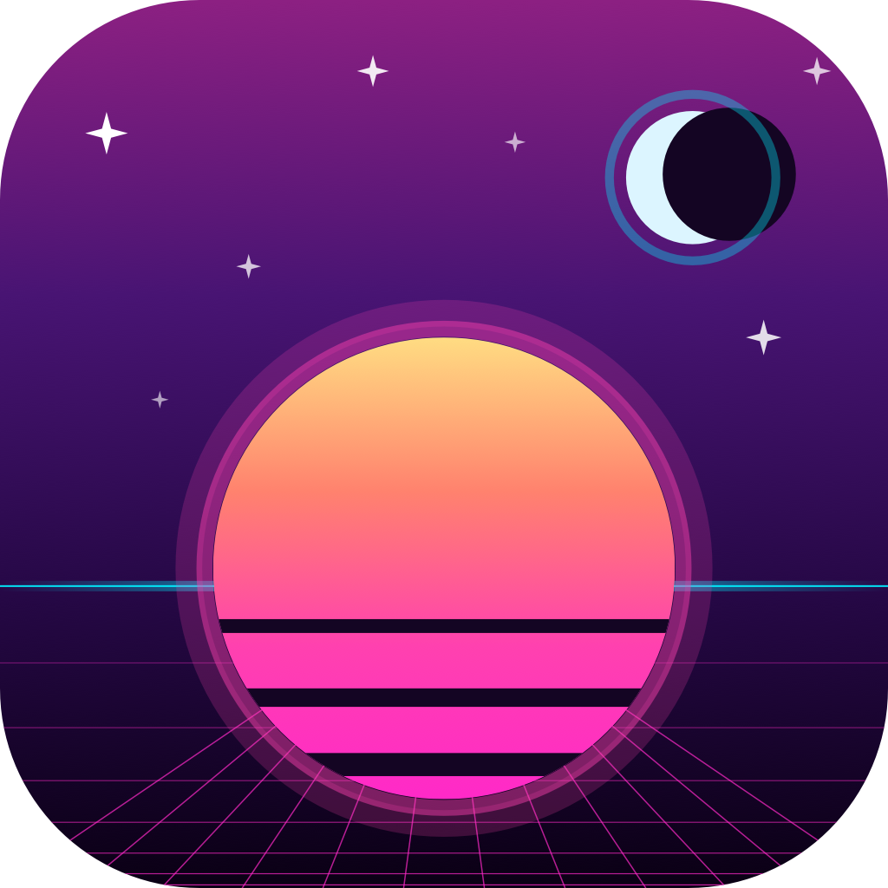

# Spacetrucker Galactic for iOS

<p align="center">
  
</p>

<p align="center"><em>The sky and the road, briefed.</em></p>

Native iOS personal almanac. Earth weather, marine weather, space weather, sunrise/sunset and twilight, moon phase, planetary positions, and upcoming launches — for wherever you are right now.

**As of v0.2 the app runs entirely on-device.** Every data source is fetched directly from the public origin (NWS, NOAA SWPC, NWS marine bulletins, aprs.fi, The Space Devs). All astronomy math (sun events, moon phase, planet positions) is computed locally. No backend service required.

## Features

- **Location-aware** via Core Location.
- **Callsign tracking.** Add APRS callsigns; load a brief at any of their last-known positions via aprs.fi (read API key configurable in Settings).
- **Marine zone** per session, for coastal and sailing use.
- **Local notifications.** Golden hour and astronomical dusk alerts scheduled 14 days ahead.
- **Home-screen widget** (small + medium) with current temperature, sun events, Kp, moon phase.
- **Full Galactic brief** including 10 planetary positions and six twilight transitions.
- **Pure-Swift, no third-party deps.** Swift 5.10+, SwiftUI, CoreLocation, MapKit, WidgetKit, UserNotifications, iOS 17+.

## Quick start

Prerequisites:
- Xcode 15.4+
- iOS 17+ simulator or device
- [XcodeGen](https://github.com/yonaskolb/XcodeGen): `brew install xcodegen`
- An aprs.fi read API key (free, register at aprs.fi) **if you want callsign lookups**

```bash
git clone https://github.com/SpaceTrucker2196/StatusGalactic-iOS.git
cd StatusGalactic-iOS
xcodegen generate
open StatusGalactic.xcodeproj
# Run in the simulator. In Settings, paste your aprs.fi key if you want callsign lookups.
```

## Architecture

```
┌──────────────────────────────────────────────────────────────────┐
│                       StatusGalactic.app                          │
│                                                                  │
│  ┌──────────────┐    ┌─────────────────────────────────────┐    │
│  │   SwiftUI    │ ─→ │           BriefBuilder              │    │
│  │   Views      │    │  (async/await fanout, error-isolated)│    │
│  └──────────────┘    └─────────────────────────────────────┘    │
│                              │                                  │
│            ┌─────────────────┼────────────────┐                 │
│            ↓                 ↓                ↓                 │
│   ┌──────────────┐ ┌──────────────────┐ ┌──────────────┐       │
│   │ Source       │ │   Astronomy      │ │  CoreLocation│       │
│   │ HTTP clients │ │   engine         │ │              │       │
│   │              │ │                  │ │              │       │
│   │ NWS, SWPC,   │ │ SunEvents,       │ │              │       │
│   │ Marine,      │ │ MoonPhase,       │ │              │       │
│   │ Launches,    │ │ Planets          │ │              │       │
│   │ APRS.fi      │ │ (Meeus formulas) │ │              │       │
│   └──────────────┘ └──────────────────┘ └──────────────┘       │
└──────────────────────────────────────────────────────────────────┘
```

### Data sources

| Layer | Origin | Auth |
|-------|--------|------|
| Earth weather | api.weather.gov | User-Agent only |
| Marine weather | tgftp.nws.noaa.gov text bulletins | none |
| Space weather (Kp + 10.7 cm flux) | services.swpc.noaa.gov | none |
| Sunrise / sunset / twilight / golden hour | Local computation (NOAA / Meeus) | n/a |
| Moon phase | Local computation (Meeus chapter 47, major periodic terms) | n/a |
| Planetary positions | Local computation (mean orbital elements + equation of center) | n/a |
| Upcoming launches | ll.thespacedevs.com | none |
| Callsign location | api.aprs.fi | aprs.fi read API key |

### Astronomy accuracy

Hand-rolled and validated against the legacy weathergalactic backend (Skyfield + JPL DE421):

| Quantity | Method | Accuracy |
|----------|--------|----------|
| Sunrise / sunset | NOAA solar position approximation | ~1 minute below 60° latitude |
| Twilight transitions (civil / nautical / astronomical) | Same, swapping zenith angle | ~1-2 minutes mid-latitude |
| Sun ecliptic longitude | Meeus 25 + equation of center | < 0.01° |
| Moon ecliptic longitude / phase | Meeus 47 major periodic terms | < 0.5° |
| Planet positions | Mean orbital elements + equation of center | ~1-3° |

The planet positions are intentionally simplified to avoid pulling in a large astronomy library or building VSOP87 from scratch. Zodiac sign assignment is correct except near boundaries; degree values may drift by a few degrees. See `parity/audits/2026-05-19-standalone-iOS.md` for the full accuracy report.

## Project layout

```
StatusGalactic/
  App/                  entry point, root TabView, Info.plist, asset catalog
  Models/Brief.swift    Brief, EarthWeather, MarineWeather, SpaceWeather, ...
  Services/
    Brief/              BriefBuilder + source HTTP clients (NWS/SWPC/Marine/APRS/Launches/HTTPError)
    Astronomy/          JulianDate, SunEvents, MoonPhase, Planets
    LocationManager.swift, CallsignStore.swift, ClientConfig.swift, NotificationManager.swift
  Features/
    Brief/              BriefView, BriefDetailView, BriefViewModel, SunStrip
    Callsigns/          list + detail + add
    Settings/           SettingsView
StatusGalacticWidget/   WidgetKit extension (shares Models + Services with main app)
StatusGalacticTests/    XCTest suite
project.yml             XcodeGen spec
parity/                 cross-platform parity workspace
ROADMAP.md              milestone plan
FEATURE_MATRIX.md       cross-platform feature matrix
```

## Tests

```bash
xcodebuild -project StatusGalactic.xcodeproj -scheme StatusGalactic \
  -destination 'platform=iOS Simulator,name=iPhone 17' test
```

12 tests cover Brief encoding round-trip, callsign store, sunrise/sunset accuracy, twilight ordering, moon phase against backend, and planet position vs backend.

## Relationship to the legacy backend

This app started as a thin client over the `weathergalactic` FastAPI service. As of v0.2 that backend is no longer required. The backend repo still exists for server-side delivery use cases (Discord webhook scheduler, future email channel, push). The iOS app does not call it.

## License

MIT. See `LICENSE`.
