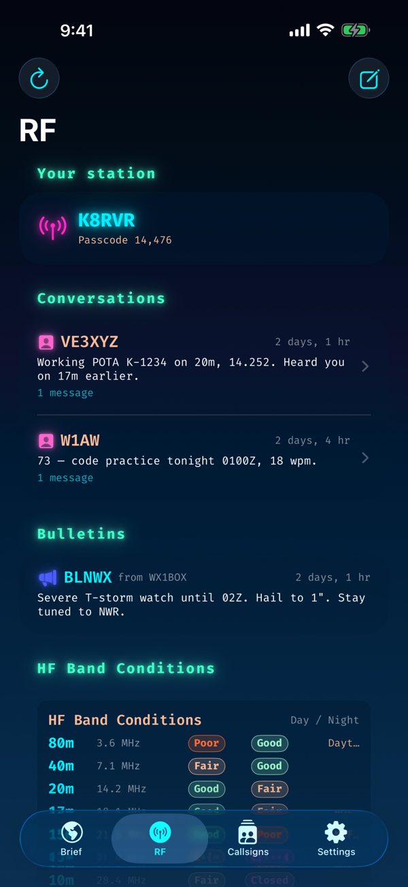
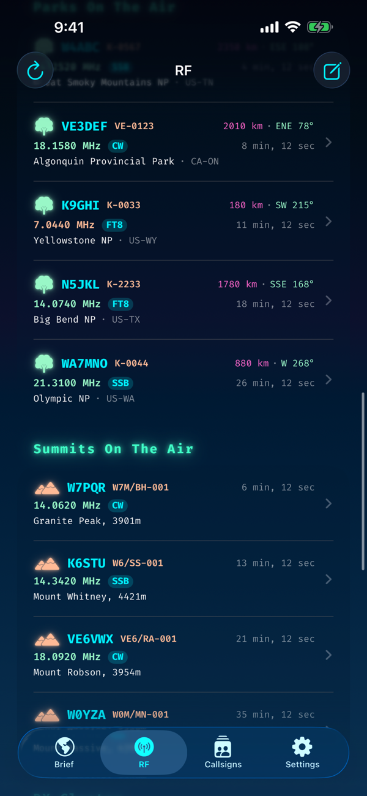
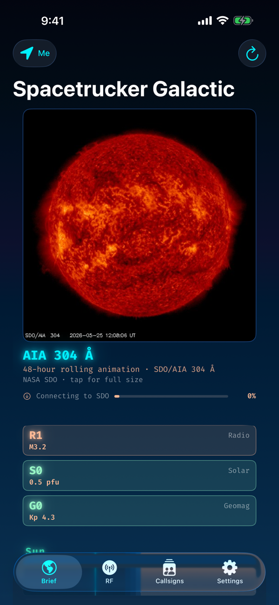
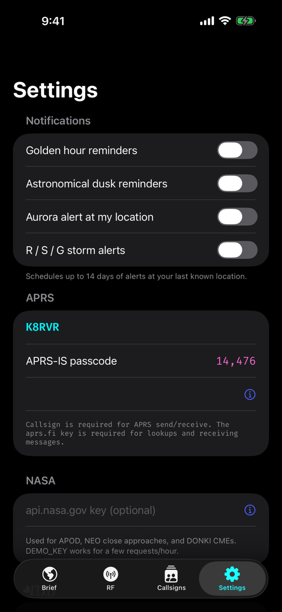
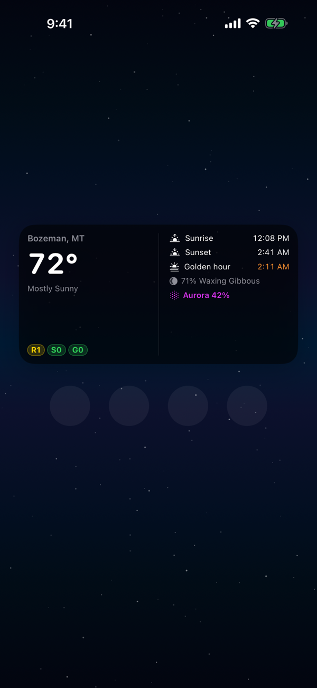

# Features

Galactic assembles a comprehensive "brief" — a single scrollable view containing everything an operator, sailor, or sky-watcher needs for the current moment and location. Each section below describes what you see, where the data comes from, and what makes it useful.

---

## Table of Contents

- [RF Tab — HF Propagation & Amateur Radio](#rf-tab--hf-propagation--amateur-radio)
- [Brief Tab — The Galactic Almanac](#brief-tab--the-galactic-almanac)
- [APRS Tab — Station Tracking & Messaging](#aprs-tab--station-tracking--messaging)
- [Callsigns Tab — Your Station Registry](#callsigns-tab--your-station-registry)
- [Mesh Tab — Meshtastic](#mesh-tab--meshtastic)
- [Settings](#settings)

---

## RF Tab — HF Propagation & Amateur Radio

The RF tab is purpose-built for amateur radio operators who want a quick read on propagation conditions and nearby activity.

### Band Conditions

Live HF band condition data derived from NOAA SWPC indices. At a glance you can see which bands are open, marginal, or closed — based on the current solar flux index (SFI), planetary A-index, and Kp.

### Aurora Forecast

OVATION model aurora probability at your latitude, plus the global oval peak value. When Kp rises above 5, aurora probability at mid-latitudes jumps — and HF propagation on higher bands degrades. This section gives you advance warning.

### POTA Spots (Parks on the Air)

Live spot list from `api.pota.app`, sorted by distance from your current position. Each spot shows:
- Activator callsign
- Park reference and name
- Frequency and mode
- Distance (km) and great-circle bearing from your QTH
- Time since spotted

Tap any spot for a detail page with a map pin and full comments.

### SOTA Spots (Summits on the Air)

Live spots from `api2.sota.org.uk` with the same distance-sorted presentation. Useful for chasing summit activations from the field.

### DX Cluster

Recent DX spots from `dxsummit.fi` showing what's audible right now across the bands. Frequency, callsign, spotter, and time.

### Magnetic Declination

Computed against the World Magnetic Model for your exact coordinates. Essential for beam headings and portable directional antennas — the difference between true north and magnetic north can be significant depending on where you are.

---

## Brief Tab — The Galactic Almanac

The Brief tab is the full Galactic almanac. It assembles data from multiple sources into a single, scrollable view organized by domain.

### Earth Weather

Six-period NWS forecast for your coordinates, pulled from `api.weather.gov`. Shows temperature, wind, conditions, and a detailed forecast narrative for each period (e.g., "Tonight", "Thursday", "Thursday Night").

### Weather Alerts

Active NWS alerts (watches, warnings, advisories) for your location. Severe weather, flood warnings, fire weather, winter storm warnings — color-coded by severity.

### Marine Weather

NWS coastal-zone text bulletins parsed into readable forecast periods. Supports all US marine zones (GMZ, AMZ, PZZ, AN, etc.). Select your preferred zone in Settings for one-tap access. Shows wind, seas, swell, and visibility.

### Tides

Tide predictions for the nearest NOAA tide station, showing upcoming high and low tide times and heights.

### River Gauges

USGS river gauge readings for nearby stations — current stage, flow rate, and flood status. Useful for kayakers, anglers, and anyone near waterways.

### Space Weather

- **Kp Index** — Current planetary K-index (0–9 scale of geomagnetic disturbance)
- **Solar Flux Index (SFI)** — 10.7 cm radio flux, the primary indicator of HF propagation potential
- **X-Ray Flux** — Current GOES X-ray background level and any active flares
- **Proton Flux** — Solar energetic particle levels
- **Solar Wind** — Speed, density, and Bz component of the interplanetary magnetic field
- **R/S/G Storm Scales** — NOAA radio blackout, solar radiation storm, and geomagnetic storm scale levels
- **Flare Probability** — 24-hour M-class and X-class flare probabilities
- **Active Regions** — Currently numbered sunspot regions with McIntosh/Hale classifications
- **Solar Cycle** — Monthly smoothed sunspot number plotted against the solar cycle progression
- **CME Events** — Coronal mass ejection reports from NASA DONKI
- **WWV Bulletin** — The latest solar-terrestrial indices bulletin (as broadcast on WWV/WWVH)
- **Kp Forecast** — 3-day Kp forecast from SWPC

### Ionosondes

Live ionogram-derived data from global ionosonde stations — critical frequencies (foF2, foEs), virtual heights, and MUF estimates for real-time HF propagation assessment.

### Sun, Twilight & Golden Hour

On-device computation of:
- **Sunrise / Sunset** — accurate to ~1 minute below 60° latitude
- **Civil twilight** (sun 0° to -6°) — enough light to read outdoors
- **Nautical twilight** (sun -6° to -12°) — horizon visible at sea
- **Astronomical twilight** (sun -12° to -18°) — sky fully dark for observation
- **Golden hour** — the 30 minutes before sunset when the light is warm and low

Displayed as a 24-hour color-coded strip showing the day's light transitions at a glance, with a "now" indicator.

### Moon Phase & Surface

- Named phase (New, Waxing Crescent, First Quarter, etc.)
- Illumination percentage
- Procedural moon surface rendering with recognizable features (Mare Imbrium, Mare Tranquillitatis, Tycho crater) faded by lit fraction

### Planetary Positions

Ten bodies (Sun, Moon, Mercury, Venus, Mars, Jupiter, Saturn, Uranus, Neptune, Pluto) computed on-device with their current ecliptic longitude expressed as zodiac sign + degree. Uses Meeus mean orbital elements with equation of center correction.

### Constellations

Currently visible constellations based on your latitude and local sidereal time.

### Near-Earth Objects (NEOs)

Upcoming close approaches from NASA's NEO API — asteroid name, size estimate, miss distance, and relative velocity.

### Earthquakes

Recent significant seismic events from USGS, sorted by proximity to your location.

### Upcoming Launches

Next orbital launches from The Space Devs — mission name, provider, launch pad, status (Go/TBD/TBC), and countdown.

### Crewed Launches & ISS

Currently crewed spacecraft and ISS pass predictions for your location.

### Mars Weather

Latest InSight / Perseverance surface weather report — temperature, pressure, wind speed on Mars.

### Astronomy Picture of the Day (APOD)

NASA's APOD used as an optional faint background behind the brief's cosmic-sky gradient. Toggleable in Settings.

---

## APRS Tab — Station Tracking & Messaging

The APRS tab provides a receive-side APRS experience:

- **Station position lookups** via aprs.fi — see any station's last-known position on a map
- **APRS messaging** — view message threads between stations
- **DX Statistics** — path-derived distance and direction stats for tracked stations
- **Symbol rendering** — APRS symbol table icons displayed inline
- **My Station** — your own callsign's last position, path, and stats

> **Note:** Galactic is a *receive-only* APRS client. It reads data from aprs.fi; it does not transmit. Use a real TNC for TX.

---

## Callsigns Tab — Your Station Registry

Save APRS callsigns for quick access:

- Add callsigns with optional label and notes
- Tap any saved callsign to load a full brief at their last-known position
- View their position on a map via MapKit
- Get directions to their last fix via Apple Maps
- Persisted to UserDefaults — stays on-device

---

## Mesh Tab — Meshtastic

Pair Galactic with a nearby [Meshtastic](https://meshtastic.org) node over Bluetooth LE and use the node as your radio while the iPhone handles the UI. Everything in this tab is local: the node is hardware you own, the BLE link is short-range, and the iPhone never reaches the internet to make Mesh work.

### STATUS

Connection state, the node's own num once handshake completes, and a discovery list of nearby Meshtastic peripherals advertising the standard service UUID (`6BA1B218-15A8-461F-9FA8-5DCAE273EAFD`).

- **Scan** advertises the Meshtastic service UUID and lists every node within BLE range with its RSSI.
- **Connect** pairs to the chosen node, subscribes to the `FromNum` and `LogRadio` notify characteristics, and issues a `ToRadio { want_config_id }` handshake. The node streams its `MyNodeInfo`, all `NodeInfo` records, and channel/config envelopes back, terminating with a matching `config_complete_id` — at which point the STATUS row flips to "Connected · *NodeName*".
- **Clear history** wipes both the in-memory feed and the on-disk SwiftData store (see "Persistence" below).

### NODES

A live directory of every node the connected radio knows about, sorted by last-heard time. Each row shows the short name, long name, battery percentage (when reported via Telemetry), and signal-to-noise ratio. The directory updates from `NodeInfo`, `Position`, and `Telemetry` packets as they arrive.

### TRAFFIC

Append-only, vaporwave-styled log of every protobuf envelope the link exchanges. Rows are tagged RX or TX with a phosphor-green or neon-cyan glow respectively, decoded by portnum, and capped at 500 entries in memory. A **pause** toggle in the section header stops auto-scrolling so you can read older rows without the latest packet kicking them off-screen.

The codec routes incoming `MeshPacket.decoded.portnum`:

| PortNum | Effect |
|---------|--------|
| `TEXT_MESSAGE_APP` | Appended to TRAFFIC and to the **SEND** chat thread |
| `NODEINFO_APP` | Updates the NODES directory (`User` payload) |
| `POSITION_APP` | Updates the node's last-known position |
| `TELEMETRY_APP` | Updates battery / device metrics |
| anything else | Logged to TRAFFIC only, with the portnum surfaced |

Encrypted packets the node doesn't have a channel key for are logged as `RX encrypted` rather than decoded.

### DEVICE LOG

Free-running tail of the `LogRadio` notify characteristic — every `LogRecord` the firmware emits, tagged by level (CRIT / ERR / WARN / INFO / DBG / TRC). Useful when bringing up a node or diagnosing a radio config issue without serial cables.

### SEND

A text field plus a chat thread. Submitting a message builds a `MeshPacket { to: 0xFFFFFFFF, channel: 0, decoded: Data { portnum: TEXT_MESSAGE_APP, payload: utf8 } }`, wraps it in `ToRadio { packet: }`, and writes it to the `ToRadio` characteristic. The message is mirrored locally (the node won't loop your own broadcast back) so you see the TX row in TRAFFIC and the outbound bubble in the chat thread immediately.

The send button is disabled until the link is fully connected and there's non-whitespace text in the field.

### Persistence

Traffic + chat history persists across app relaunches via [SwiftData](https://developer.apple.com/documentation/swiftdata) under the app's own `Library/Application Support/Meshtastic.store`. Two model types are stored:

- `PersistedTrafficEntry` — every TRAFFIC row, capped at 5,000 with FIFO eviction.
- `PersistedChatMessage` — every chat message (sent + received), capped at 2,000 with FIFO eviction.

The store is intentionally pinned to the app's own sandbox (*not* the widget's App Group container) so Mesh history isn't visible to the widget.

### Privacy

- Bluetooth permission is requested only when the Mesh tab first appears; it's not asked for at app launch.
- The iPhone never relays Mesh traffic to the internet. Everything stays between your phone and the node.
- The Meshtastic protobuf bindings under `Services/Meshtastic/Generated/` were regenerated locally with `apple/swift-protobuf` (Apache-2.0) from a vendored snapshot of [`meshtastic/protobufs`](https://github.com/meshtastic/protobufs). No code from the GPLv3 `Meshtastic-Apple` client was copied; the CoreBluetooth wrapper, codec, store, and view are all original. See `Services/Meshtastic/proto/NOTICE.md` for the license posture in detail.

### Out of scope (v1)

- TCP / Wi-Fi transport (BLE only)
- Encrypted channels beyond the primary
- Channel management UI (PSK rotation, QR pairing)
- Position sharing from the phone to the mesh
- Background scanning / push notifications on new messages
- iPad layout (the app is iPhone-only at launch)

---

## Settings

Configurable options:

| Setting | Purpose |
|---------|---------|
| **My Callsign** | Your amateur radio callsign (used in APRS station view) |
| **aprs.fi API Key** | Required for callsign position lookups (free from aprs.fi) |
| **NASA API Key** | For APOD backgrounds and NEO data (free from api.nasa.gov) |
| **Default Marine Zone** | Your preferred NWS marine forecast zone (e.g., GMZ033) |
| **User-Agent** | Identifies the app to NWS (required by their API policy) |
| **APOD Background** | Toggle the Astronomy Picture of the Day as brief background |
| **Golden Hour Notifications** | Alert 30 minutes before sunset |
| **Astronomical Dusk Notifications** | Alert at astronomical twilight |
| **Aurora Alerts** | Alert when aurora probability exceeds your threshold |
| **Storm Alerts** | Alert on geomagnetic/radio storm events |

---

## Widgets

Home-screen widgets in two sizes:

- **Small** — Location, current temperature, current condition, next sun event with relative time
- **Medium** — All of the above plus sunrise/sunset, next golden hour, moon phase, Kp index, and R/S/G storm scale pills

Widgets refresh on a 30-minute timeline and read shared data from the App Group container.

---

## Watch App & Complications

Standalone watchOS 10+ app with:
- Location header
- Current weather card
- Space weather card (Kp, SFI)
- Sun card with next event countdown
- Moon card with phase

Complications in all four watchOS accessory families:
- `accessoryCircular` — Kp gauge
- `accessoryCorner` — Next sun event
- `accessoryInline` — Brief one-liner
- `accessoryRectangular` — Multi-line weather + space summary
